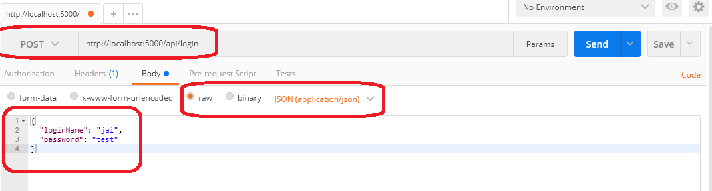

# LeanMood Backend 

LeanMood backend project will be a REST /JSON api, hopefully based on express, mongoose, mongodb.

# Steps to setup and run the project

## Prerequisites

> Prerequistes: be sure to have installed in your computer nodejs and mongo db.

- Ensure you have running mongodb, in case not run the following command from the command prompt

```
mongod
```

> In case it fails, check if you have the mongodb bin path in the enviroment variables:https://stackoverflow.com/questions/15053893/error-when-trying-to-connect-to-a-mongod

## Setting up the seed database

- Let's cd to our project root folder.

- Open a new command prompt console and run _mongo_

```cmd
mongo
```

- From the mongo console let's list all of the databases that are installed:

```cmd
show dbs
```

- In case _leanMood_ database is already in the server let's remove it and start from scratch


```
mongo leanMood --eval "db.DropDatabase()"
```

- Now let's create _leanMood_ database.

```cmd
use leanMood
```


- Let's import the user seed data (you will run this just from the command prompt, do not connect to mongo cli).

```cmd
mongoimport -d leanMood -c users --type json --file ./meta/data/user.seed.json --jsonArray
```

# Starting the rest api server

> Ensure you have mongodb up and running and the _leanMood_ installed including seed data.

- Open a new command prompt window, cd to the project root folder (same level where _package.json_ is placed).

- Install all the dependencies:

```cmd
npm install
```

- Let's run the project

```
npm start
```

- Now it's time to test that we can hit the rest api, let' s open [postman](https://www.getpostman.com/), we will
sen a query like:
    - URL: http://localhost:5000/api/login
    - Command: POST
    - Headers:

```cmd    
    Cotent-Type: 'application/json'
```

    - Body (raw, JSON Application):

```json
{
  "loginName": "jai",
  "password": "test"
}
```

 > If it doesn't work check if you have _PostMan Interceptor_ turned on (in that case turn it off).



# References

Resources:

[Mongo Lab Arquitecture Guidance](https://blog.mlab.com/2017/05/mongodb-connection-pooling-for-express-applications/) 